# Setting up a Raspberry Pi rig

Note: there are two key ways to setup a Pi rig. One uses Pi Bakery, the other is a manual method. If your Pi Bakery process does not work, just use [Option B](#Option-B). 

## Option A - Use Pi Bakery

There are many ways setup Raspian (the operating system...like jubilinux is for Edison board) microSD card to use in your Raspberry Pi.  One easy way for a new user is to use PiBakery, a free application you'll download from the internet. (Note that if this is not successful, you can switch to [Option B](#Option-B) below). 

Download PiBakery [here](http://pibakery.org/download.html).  Follow the directions for installing PiBakery on your computer (the directions on their site include screenshots that are helpful).  The download is fairly large (2.2GB) so it may take a couple minutes to complete.

Once you open PiBakery installer, you will be presented with a choice of installing Raspian Full or Raspian Lite.  Unselect the checkbox for Raspian Full, and keep the installation for Raspian Lite.  When the installation is done, you will be asked if you want to move the PiBakery installer to the trash.  That is fine to do.

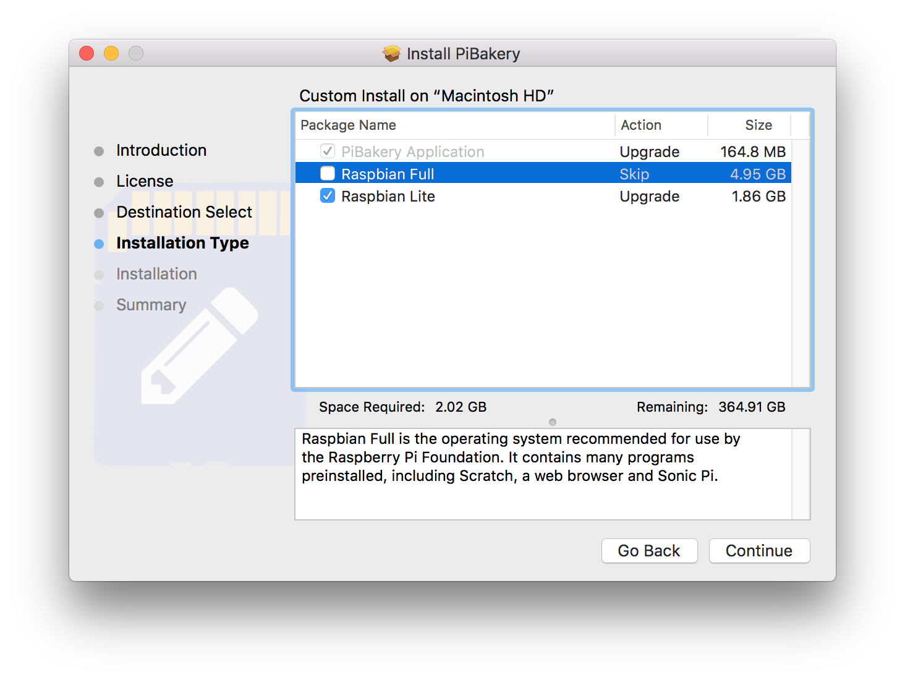

When the install has finished, find and open the PiBakery app from your applications folder on the computer.  You may be prompted for your computer's passcode; if so, enter it.

The starting screen for the PiBakery is fairly empty, but we are going to basically use visual boxes to build a puzzle of what we would like to install on our SD card.  So start by clicking on the "Startup" selection on left column.  Click, drag, and drop the "on first boot" box over to the white area to the right of the window.  

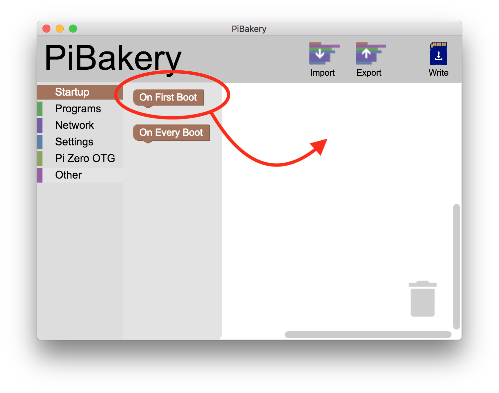

Next, click on the Network category and drag over the Setup Wifi box to near the On First Boot box.

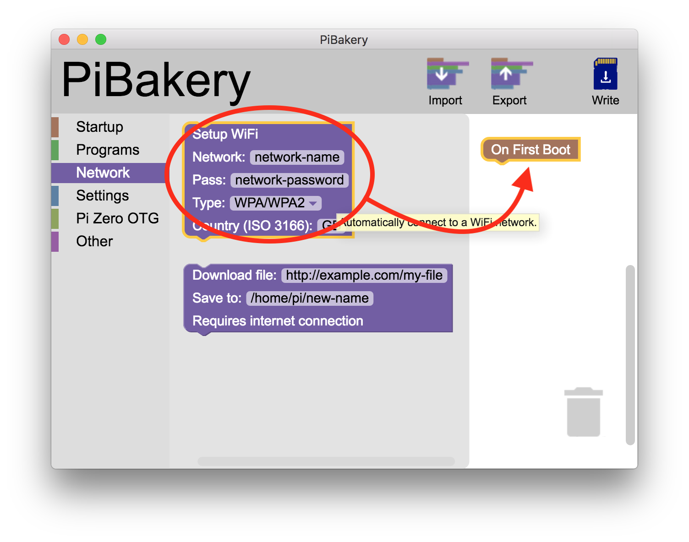

You want to have the boxes link together (if you have audio on, you'll hear a little click noise as the boxes link together).  You can drag more wifi network boxes if you already know the wifi networks that you'd like to add already.  Don't worry though, you'll have the opportunity to add more later...this is just an important step to get started the first time with at least one network.

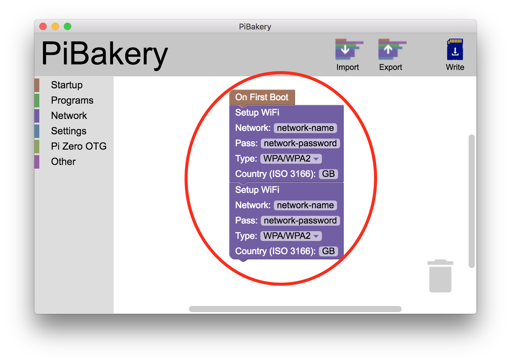

Note:  Raspbian requires a Country Code (such as US, UK, DE, etc) - otherwise wifi will remain disabled on the Pi.  This is different than the Edison/Jubilinux setups so be aware!  The default country code is GB, because that is where the PiBakery author is from.  Most users will need to change this.  Wondering what the codes are?  You can look up your two letter code [here](https://www.iso.org/obp/ui/#search/code/).

Enter in your network name, password, and country code.  Capital and lowercase matter.  You can leave the type as WPA/WPA2 unless you specifically know your network uses a different connection type.

You can add as many special "recipe ingredients" as you'd like.  Advanced users may find ingredients they are specifically interested in.  Shown below is a relatively simple setup that will have good utility (one wifi network and setting the OTG port to serial to make future offline-connections easier).  

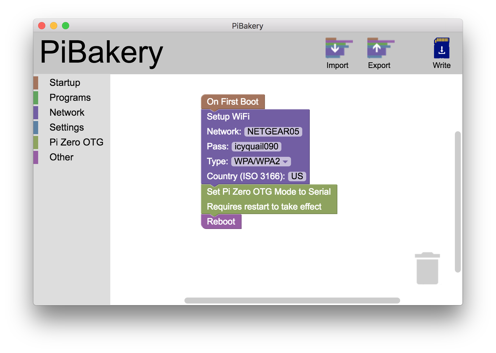

Put your microSD card into a reader for your computer.  Once you get your recipe completed in PiBakery, click on the "Write" icon in the upper left of the window. You'll select your SD card's name from the menu that appears and the Operating System will be Raspbian Lite.  Click the Start Write button.  Click yes to the warning about erasing the content of the card to begin the writing process.

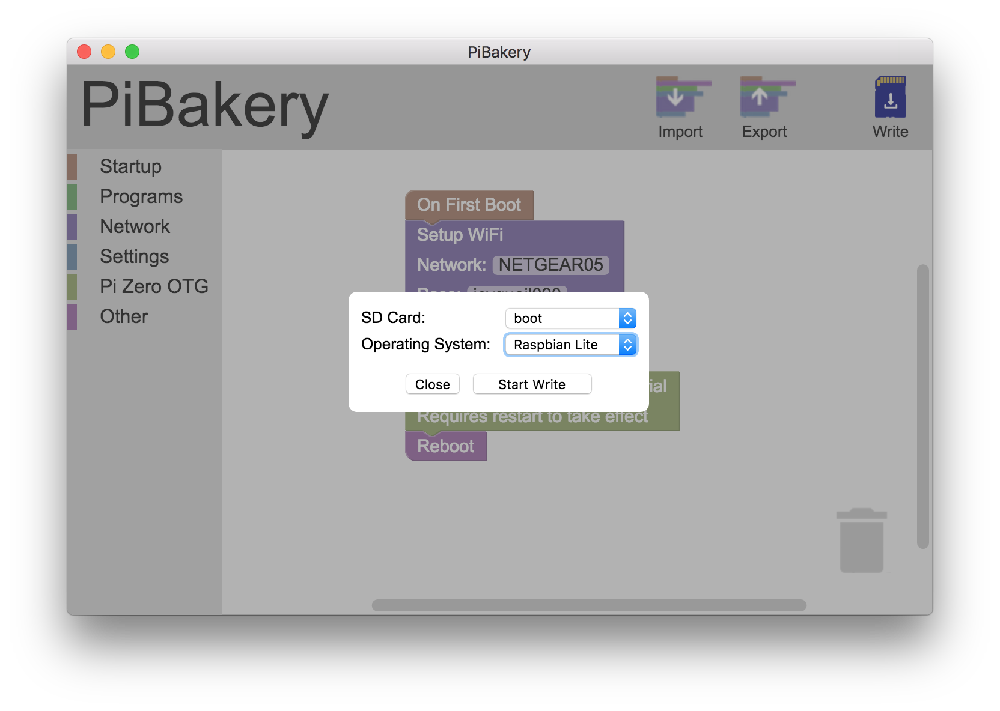

### Boot up your Pi and connect to it ###

After a couple minutes, the writing should be done and you can eject the microSD card from your computer, insert it into your Pi (card slot location shown below), and plug in power to the Pi, and turn on the power switch (off/on positions are labeled on the HAT board for ease).

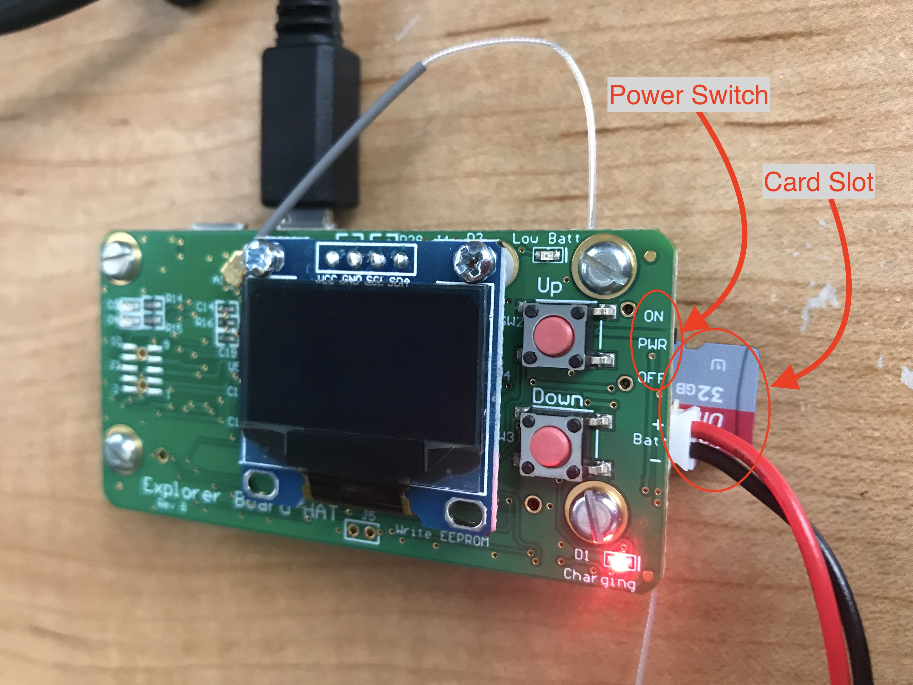

Give the rig a couple minutes to boot up.  Once the green LED stops blinking as much, you can try to log in.

On Mac, open Terminal and use `ssh pi@raspberrypi.local`

On Windows, use PuTTY and establish an SSH connection, with username `pi`, to hostname `raspberrypi.local`. If you receive a warning that the rig's host key is not yet cached, respond YES to add it.

Troubleshooting:  If you have problems connecting, try rebooting your router.  If you have multiple channels (2.4Ghz vs 5Ghz), you could try redoing the PiBakery setup with the other channel's network name, if the first one fails.

The default password for logging in as `pi` is `raspberry`.  The `pi` username and default password is only used for this initial connection: subsequently you'll log in as `root` with a password and rig hostname of your choosing.

### Run openaps-install.sh ###

Once you're logged in, run the following commands to start the OpenAPS install process:

```
sudo bash
curl -s https://raw.githubusercontent.com/openaps/oref0/dev/bin/openaps-install.sh > /tmp/openaps-install.sh && bash /tmp/openaps-install.sh
```

* Change your hostname (a.k.a, your rig's name). **Make sure to write down your hostname; this is how you will log in in the future as `ssh root@whatyounamedit.local`**

* You'll be prompted to set two passwords; one for root user and one for pi user.  You'll want to change the password to something personal so your device is secure. Make sure to write down/remember your password; this is what you'll use to log in to your rig moving forward. You'll type it twice for each user.  There is no recovery of this password if you forget it.  You will have to start over from the top of this page if you forget your password.

* Pick your time zone (e.g., In the US, you'd select `US` and then scroll and find your time zone, such as `Pacific New` if you're in California).

The script will then continue to run awhile longer (10 to 30 minutes) before asking you to press `enter or control-c` for the setup script options.  Successful completion of this section should look like below.  

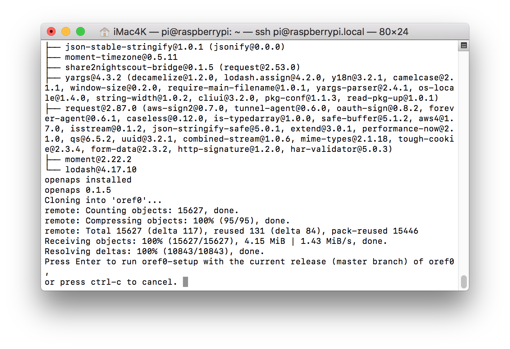

**If you are installing to a Pi with a legacy radio (Ti-stick, SliceOfRadio, etc.) - Press enter.  [Jump to finishing the installation](#finish-installation)**

**If you are installing to a newer Pi with a HAT or RFM69HCW as radio: Do not press enter!  [Continue on to Pi-Hat instructions.](#switch-to-dev-branch-for-your-pi-hat).**

Troubleshooting:  If your screen stops as shown below or jumps ahead to the interactive portion before successful completion (as shown above), rerun the curl -s command line shown above.  

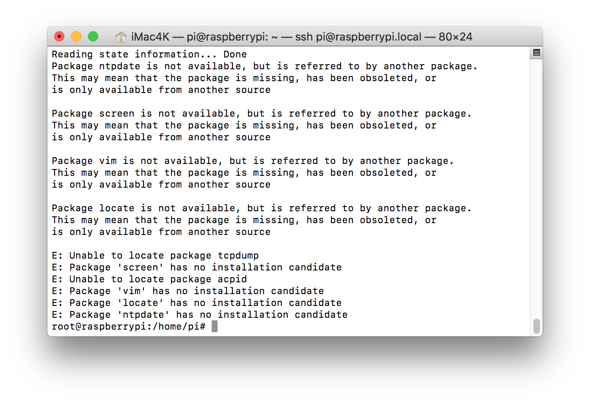

**************************
### Switch to dev branch for your pi HAT ###
If you are here - you should be building a rig with a Pi HAT(recommended) or RFM69HCW (experimental).  Instead of proceeding with the setup script, press `control-c` to cancel the setup script.

Reboot your rig by entering `reboot`.  This will end your ssh session.  Give your rig time to reboot, reconnect to wifi, and then login to the rig again.  This time the rig will be using the rig name you chose before in the setup so use `ssh root@yourrigname.local` on a Mac.  On a Windows PC with PuTTY, the hostname can be either `yourrigname` or `yourrigname.local`, and the username will be `root`.

Now we will select a Raspian-compatible updated branch by using `cd ~/src/oref0 && git checkout dev`. On your first install you should see a message returned of "Branch dev set up to track remote branch dev from origin. Switched to a new branch 'dev'". On subsequent installs or updates you would follow the direction to execute the command "git pull".

### Finish installation ###

First, update npm to the latest version. Run `npm install npm@latest -g`. 

Next, change to the oref0 directory if you are not in it already. Run `cd ~/src/oref0`. 

Now run `npm run global-install`.  After about 10-15 minutes, the installations will end and you will be dropped off at the `root@yourrigname:~/src/oref0#` prompt.  Successful completion of this step should look like below.

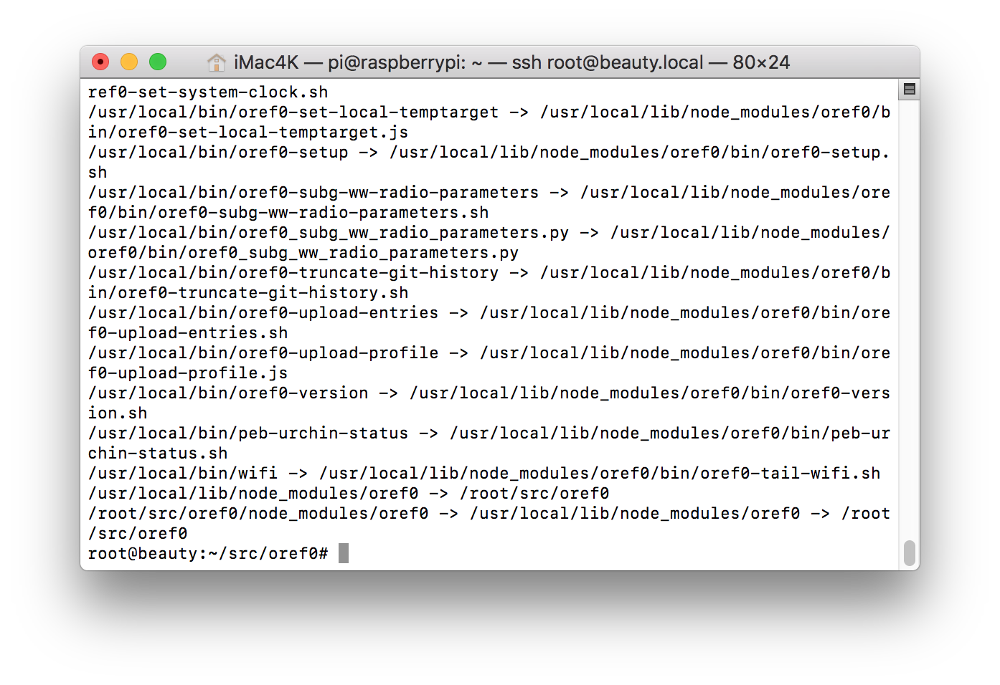

Now you can run the interactive oref0 setup script:

`cd && ~/src/oref0/bin/oref0-setup.sh`

Answer all the setup questions.  A successful setup script will finish asking you if you want to setup cron.  Say yes to those two questions.  Finally, you'll see a message about Reboot required.  Go ahead and reboot the rig.  You've finished the loop installation. Login to the rig again. 
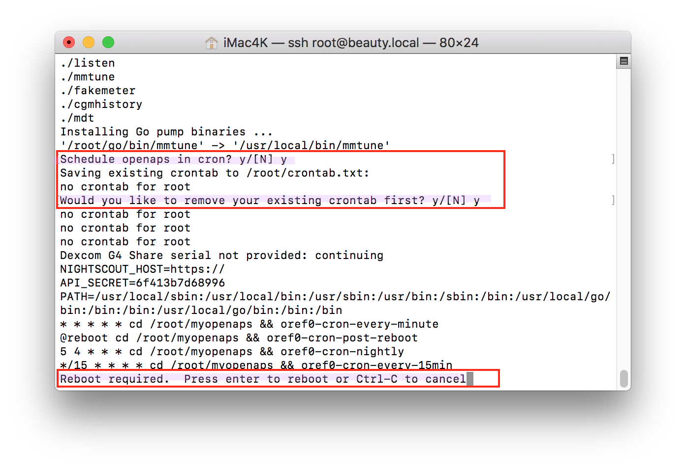

**Troubleshooting**: If your rig gets stuck at the point shown below, simply login to the rig again and run the setup script one more time.  Usually, running the setup script a second time will clear that glitch.
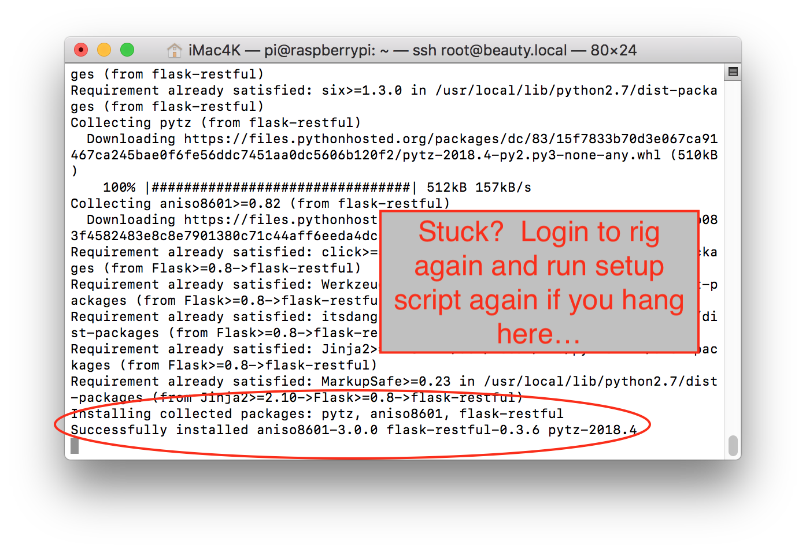

Once your setup script finishes, **make sure to [watch the pump loop logs](http://openaps.readthedocs.io/en/latest/docs/Build%20Your%20Rig/OpenAPS-install.html#step-5-watch-your-pump-loop-log)**

**NOTE**: If you are using RFM69HCW as RF module:

If you have connected your RFM69HCW module as described in [Soldering RFM69HCW](https://openaps.readthedocs.io/en/latest/docs/Gear%20Up/edison.html#soldering), while running interactive setup use following option:
```
3) RFM69HCW (DIY: SPI)
```
and then select your ttyport, depending on which you have wired your RFM69HCW to (CE0 on RPi pin 24 will be `/dev/spidev0.0`, CE1 on RPi pin 26 will be `/dev/spidev0.1`):
```
3) RFM69HCW on /dev/spidev0.0 (walrus)
4) RFM69HCW on /dev/spidev0.1 (radiofruit bonnet)
```

*****************************

## Option B 

### Download Raspbian and write it to your microSD card ###

Following the [install instructions](https://www.raspberrypi.org/documentation/installation/installing-images/README.md), download Raspbian Lite (you do **not** want Raspbian Desktop) and write it to an microSD card using Etcher.

### Place your wifi and ssh configs on the new microSD card ###

Once Etcher has finished writing the image to the microSD card, remove the microSD card from your computer and plug it right back in, so the boot partition shows up in Finder / Explorer.

Create a file named wpa_supplicant.conf on the boot drive, with your wifi network(s) configured.  The file must be in a Unix format.  If creating the file in Windows, use an editor that allows you to save the file in Unix format instead of DOS format. There are many editors with this ability. `Notepad++` is one that works well. The file should look something like:

```
country=xx
ctrl_interface=DIR=/var/run/wpa_supplicant GROUP=netdev
update_config=1
network={
  ssid="MyWirelessNetwork"
  psk="MyWirelessPassword"
}
```

You will need to replace xx after country with the correct ISO3166-1 Alpha-2 country code for your country (such as US, UK, DE, etc) - otherwise wifi will remain disabled on the Pi.

To enable SSH login to the Pi, you will need to create an empty file named `ssh` (with no file extention).
On Windows, you can make this file appear on your Desktop by opening the command prompt and typing:
```
cd %HOMEPATH%\Desktop
type NUL > ssh
```
On a Mac, the equivalent command is:
```
cd ~/Desktop/
touch ssh
```

When you are done, copy it from your Desktop to the boot drive of your SD card.

### Boot up your Pi and connect to it ###

Eject the microSD card from your computer, insert it into your Pi, and plug in power to the Pi to turn it on.  Give it a couple minutes to boot up.  Once the green LED stops blinking as much, you can try to log in.

On Mac, open Terminal and `ssh pi@raspberrypi.local`

On Windows, use PuTTY and establish an SSH connection, with username `pi`, to hostname `raspberrypi.local`. 

The default password for logging in as `pi` is `raspberry`.  The `pi` username and default password is only used for this initial connection: subsequently you'll log in as `root` with a password and rig hostname of your choosing.

### Run openaps-install.sh ###

Once you're logged in, run the following commands to start the OpenAPS install process:

```
sudo bash
curl -s https://raw.githubusercontent.com/openaps/oref0/dev/bin/openaps-install.sh > /tmp/openaps-install.sh && bash /tmp/openaps-install.sh
```

You'll be prompted to set a password.  You'll want to change it to something personal so your device is secure. Make sure to write down/remember your password; this is what you'll use to log in to your rig moving forward. You'll type it twice.  There is no recovery of this password if you forget it.  You will have to start over from the top of this page if you forget your password.

* Change your hostname (a.k.a, your rig's name). **Make sure to write down your hostname; this is how you will log in in the future as `ssh root@whatyounamedit.local`**

* Pick your time zone (e.g., In the US, you'd select `US` and then scroll and find your time zone, such as `Pacific New` if you're in California).

The script will then continue to run awhile longer (~10+ minutes) before asking you to press `enter` to run oref0-setup.

Return to the [OpenAPS Install page](http://openaps.readthedocs.io/en/latest/docs/Build%20Your%20Rig/OpenAPS-install.html#step-4-setup-script) to complete oref0-setup. 

**If you are installing to a Pi with a legacy radio (Ti-stick, SliceOfRadio, etc.) - Press enter. [Jump to finishing the installation](#finish-installation)**

**If you are installing to a newer Pi with a HAT as radio: Do not press enter!  [Continue on to Pi-Hat instructions.](#switch-to-dev-branch-for-your-pi-hat).**
