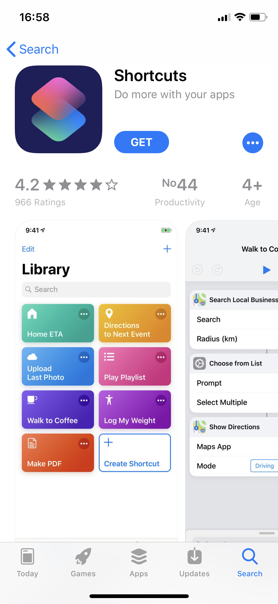
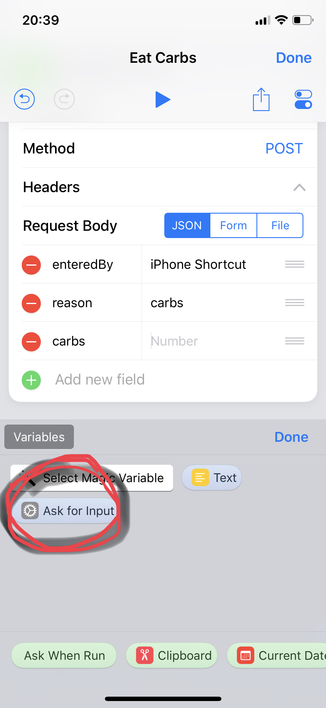

# iPhone Shortcuts Integration

In June 2018 Apple released iOS 12 which renamed Workflow to Shortcuts and unfortunately removed the IFTTT integration. 
Early OpenAPS users were able to integrate Workflow/Shortcuts with their Nightscout site using the excellent IFTTT 
service, but 
You can however achieve the same result of a button press on an iPhone sending instructions to your Nightscout site by
following these instructions. 

**Note** All of these integrations send instructions to your Nightscout site over the internet. Your phone will not be
communicating directly with your rig so your phone must be online and your rig must have internet connectivity too to
retrieve these instructions. 

With these instructions you will gather and use:

* Your Nightscout site's URL
* Your "hashed API Secret" which is sometimes called hash-api-secret", sometimes "apisecrethash" and sometimes just 
"secret"

As with all technical instructions, every single character counts. If your laptop is a Mac, it is recommended to 
enable [Copy and paste between devices from your 
Mac](https://support.apple.com/guide/mac-help/copy-and-paste-between-devices-mchl70368996/mac) so that you can read 
these instructions on your laptop, `command-C` copy them on your laptop and paste them on your iPhone.

## Get your "hashed API Secret"

First we need to gather one thing called your "hashed API Secret".  This is a scrambled version of your Nightscout 
site's API secret, resulting in a confusing long string for safety. 

### Get your "hashed API Secret" ... while logged into your rig
Find out what your NS hashed secret key is by running this command to find out:
 
`nightscout hash-api-secret <your_API_secret>` 

### Get your "hashed API Secret" ... while logged into your Nightscout site

In your internet browser, open a console window while viewing your Nightscout site.  Make sure you have "authenticated" 
your site by using your API secret in the Nightscout settings area (hint: if you see a little padlock in the upper left 
corner of the site, you haven't authenticated it).  Refresh the site and your hashed secret key will be shown as 
"apisecrethash: "xxxxxxxxxx...""  

For Safari users on Mac, you can open the console window by selecting "Develop" from the Safari top menu, and then 
"Show Page Source" (if you do not see "Develop" in the top menu, activate it by going to Safari > Preferences... > 
Advanced, and checking the "Show Develop menu in menu bar" option).  If you're having problems seeing the apisecrethash,
 click the little grey triangle next to the "status isAuthenticated" line and the objects below it will display 
 (see screenshot).  Your hashed API secret can be copied and pasted from that line, as shown below.  Save that somewhere 
 easy to get to again, because you will be using it later.

## Install "Shortcuts" in your iPhone

The Shortcuts app is from Apple, but is not installed by default. 

* Open App Store
* Search for "Shortcuts". The one you want is "**Shortcuts** Do more with your apps" from Apple. 

* Go through the "Welcome to Shortcuts" screens, and click on the "+ Create Shortcut" button in your "Library" to get
started.

## Create your first shortcut "Cancel Temp Target"

What you will do is create a shortcut which will communicate directly with your Nightscout site to send a command that 
will cancel any Temp(orary) Targets that are in effect. It's a good example to start with as it is the simplest and, 
unless you do have a temporary target, the effects to your diabetes will be slight.

This shortcut will consist of 3 parts - called "actions":

* the URL to send the instruction to (easy)
* the instruction to send (this will take some time)
* what to do with the reply from your Nightscout site (easy, but a little trick)

In the end, your new shortcut will look like this:

### Text
Search for the action called "Text" (not the "Get Text from Input") and add 

`https://yoursite.herokuapp.com/api/v1/treatments.json` (change the "yoursite.herokuapp.com" part to your NS info)`

This is where the instruction will be sent. Click on the lower right "Done" when ready.

### Get Contents of URL
This will be the instruction that is sent. In this "action" there are many details that must be correct. Start by 
tapping on "Advanced".

* Method: Initially it will be "GET", change it to "POST".
* Headers: your don't need to do anything here
* Request Body: Initially it will be JSON - leave it as JSON - but you will need to add new fields, 4 for the (simple)
instruction to "Cancel Temp Target". The values for these 4 are:

  * type of value=`Text`, Key=`enteredBy`, Text=`iPhone Shortcut` (or whatever you want here)
  * type of value=`Text`, Key=`eventType`, Text=`Temporary Target` (you cannot change this, Nightscout needs it)
  * type of value=`Number`, Key=`duration`, enter `0` (this sets the remaining duration of any current temp to zero, 
  cancelling it)
  * type of value=`Text`, Key=`secret`, Text=`<the value of your "apisecrethash" from above, without quotes>` (you 
  cannot change this)

###  If
You will want to know that fthe instruction was successfully sent. Here we will set up the Shortcut to vibrate the phone
when it looks like everything worked and to show the error message if something is wrong.

This one is "tricky" to set up as:
* First, you need to search-for and find "If". 
  * Input - `Contains`, Value=`"_id":` (this time, possibly one of the only times, you **DO** want to have the double 
  quotes exactly as shown here.)
* Second, find "Vibrate Device" but push-and-hold it, and move it up above "Otherwise": see the next image.
* Third, find "Get Text from Input" and "Show Result" and move both of them above the "End If"
  * Here you choose the `Contents of URL` to see the error message that Nightscout returned.

## Customise your first shortcut "Cancel Temp Target"
Congratulations - you've created your first "iPhone Shortcuts to Nightscout" Integration - time now to customise it with
a name, colour and icon. 

On the top right of the phone, there's a "Done" text button and under it there's the "Share" icon and a "Settings" icon
which you will want to push.

In the "Name" field, click on the (default) name and change it to something like "Cancel Temp Target" and then give it
an icon you like. 

When you're done, click "Done"

## Test your shortcut
You should now test that all works as you expect. Try running it - it should take about one second to run, and just 
after it finishes the three dots on the top-right will change to a tick-mark for a short time. This shows that 
everything worked as expected.

To see what happens when things go wrong try both of these:

### Test with a bad URL
* In the **Text** action at the very top of the Shortcut, add an "s" to the end of the URL - like this:
`https://yoursite.herokuapp.com/api/v1/treatments.jsons` 
* When you try to run the shortcut you'll see Nightscout's error. 

* Remember to remove that extra s!

### Test with a bad apisecrethash
* In the **Get Contents of URL** action, add an extra "X" to the end of the `secret` field.
* When you try to run the shortcut you'll see Nightscout's error. 

* Remember to remove that extra "X"!

**Congratulations** You have created and tested your first Shortcut!

## Create more Shortcuts

Now that you've got your first shortcut, you'll want some more! The steps are the same for all of these except there 
will be more, and different values for the "**Get Contents of URL**" fields.

### Examples

    shortcut            | type   | Key          | Value 
    --------------------|--------|--------------|----------------
    Eating Soon         | Text   | enteredBy    | iPhone Shortcut 
                        | Text   | eventType    | Temporary Target 
                        | Text   | reason       | Eating Soon 
                        | Number | targetTop    | 80 
                        | Number | targetBottom | 80 
                        | Number | duration     | 60 
                        | Text   | secret       | <your-apisecrethash> 
                            
    Activity            | Text   | enteredBy    | iPhone Shortcut 
                        | Text   | eventType    | Temporary Target 
                        | Text   | reason       | Activity 
                        | Number | targetTop    | 140 
                        | Number | targetBottom | 120 
                        | Number | duration     | 120 
                        | Text   | secret       | <your-apisecrethash> 
    
    Cancel Temp Target  | Text   | enteredBy    | iPhone Shortcut 
                        | Text   | eventType    | Temporary Target 
                        | Number | duration     | 0 
                        | Text   | secret       | <your-apisecrethash> 
                        
    Low Treatment       | Text   | enteredBy    | iPhone Shortcut        
                        | Text   | reason       | low treatment     
                        | Number | carbs        | 10 (change carb amount to match your typical low treatment)                      
                        | Text   | secret       | <your-apisecrethash>   

    Low Treatment w/60  | Text   | enteredBy    | iPhone Shortcut 
    min high target to  | Text   | eventType    | Temporary Target 
    help recovery       | Text   | reason       | low treatment 
                        | Number | carbs        | 5 
                        | Number | targetTop    | 120 
                        | Number | targetBottom | 120 
                        | Number | duration     | 60 
                        | Text   | secret       | <your-apisecrethash> 

### Understanding the fields in these instructions:

* enteredBy: Will show up on the NS website this way - enter what you want
* eventType: defines what we are doing - leave as is
* reason: will show up on the NS website - enter what you want
* targets: specify the range you want - enter what you want
* duration: you can make them as long or as short as you want - enter what you want
* secret: your hashed API secret key...NOT your regular API secret

## A short note on entering a value 
You might want to have an "Eat Carbs" shortcut which allows you to enter the amount of carbs. 

To do that you will want to:

* copy one of the existing shortcuts (easiest way seems to be to "Share" and "Duplicate Shortcut") to get the right
  Nightscout site URL and secret
* Insert at the top of the activities an "Ask for Input" with a "Question" of `Carbs?` and an "Input Type" of `Number`.
I leave the "Default Answer" empty as I always seem to have to empty it first.
* In the "Get Contents of URL" you'll want a new `Number` field, Key=`carbs` and for the value, first delete the `0` and
then click `Variables` and choose `Ask for Input`. 

You'll want to leave everything else the same. When you run this, you'll be asked for the carbs amount and that value 
will be sent to your Nightscout.

