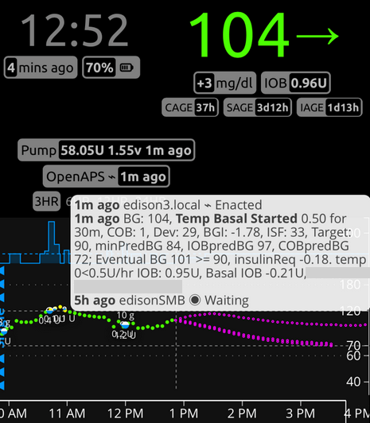
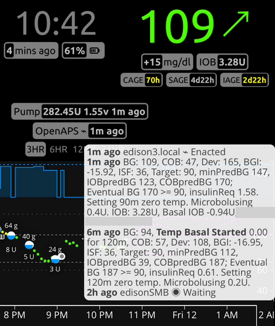
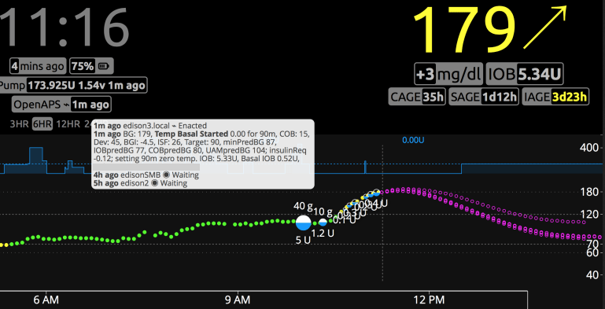
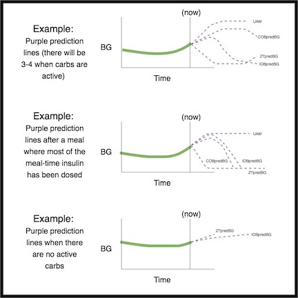

# Understanding the determine-basal logic

The core, lowest level logic behind any oref0 implementation of OpenAPS can be found in [`oref0/lib/determine-basal/determine-basal.js`](https://github.com/openaps/oref0/blob/master/lib/determine-basal/determine-basal.js). That code pulls together the required inputs (namely, recent CGM readings, current pump settings, including insulin on board and carbohydrates consumed, and your profile settings) and performs the calculations to make the recommended changes in temp basal rates that OpenAPS could/will enact. 

## Basic diabetes math

OpenAPS follows the same logic that a person with diabetes uses to make dosing decisions. Generally, this means looking at the current BG; subtracting the target; and applying your ISF (correction factor) to determine how much insulin is needed to correct the blood sugar to target. You can subtract any "insulin on board" from the amount needed. You can also add insulin needed to cover carbohydrates.

In OpenAPS, we can do both a positive (more insulin) and a negative (less insulin) correction by making adjustments to your underlying basal rates to adjust insulin up or down to help bring the "eventual" BG into target. 

## OpenAPS decision inputs

In OpenAPS, we take the same inputs you would use to manually decide what to do, but we also factor other things into our calculation.

This includes:

* Blood glucose information
  * `delta` = change in BG between `glucose` (most recent BG) and an average of BG value from between 2.5 and 7.5 minutes ago (usually just a single BG value from 5 minutes ago)
  * `glucose` = most recent BG
  * `short_avgdelta` = change in BG between `glucose` (most recent BG) and an average of BG values from between 2.5 and 17.5 minutes ago (that average represents what BG levels were approximately 10 minutes ago)
  * `long_avgdelta` = change in BG between `glucose` (most recent BG) and an average of BG values from between 17.5 and 42.5 minutes ago (that average represents what BG levels were approximately 30 minutes ago)

* Past insulin dosing information, pulled from your pump
  * `iob` = Units of Insulin on Board (IOB), ***net*** of your pre-programmed basal rates. Net IOB takes all pre-programmed basal, OpenAPS temp basal, and bolus insulin into account. Note: `iob` can be negative when OpenAPS temp basal rate is below your pre-programmed basal rate (referred to as "low-temping"). *This will always be different than pump-calculated IOB, because it only takes into account boluses - ignore pump IOB.* This is a high level overview, but you can dive into more detail around how insulin activity is calculated [here](http://openaps.readthedocs.io/en/latest/docs/While%20You%20Wait%20For%20Gear/understanding-insulin-on-board-calculations.html).
  * `basaliob` = Units of ***net*** basal Insulin on Board (IOB). This value does not include the IOB effects of boluses; just the difference between OpenAPS temp basal rates and your pre-programmed basal rates. As such, this value can be negative when OpenAPS has set a low-temp basal rate. 
  * `bolusiob` = Units of bolus Insulin on Board. Does not take into account any temp basals.

* We also add other calculations that we do to better predict and analyze what is happening:
  * `dev` or `deviation` = how much actual BG change is deviating from the BGI 
  * `BGI` (Blood Glucose Impact) = the degree to which BG “should” be rising or falling based on insulin activity alone. 
  * `ISF` = ISF is anchored from the value in your pump; but if you use autotune and/or autosens, the ISF value shown is what is currently being used by OpenAPS, as modified by the Sensitivity Ratio
  * `CR (Carb Ratio)` = As with ISF, it is anchored from the value in your pump; but if you use autotune and/or autosens, the CR value shown is what is currently being used by OpenAPS
  * `Eventual BG `= what BG is estimated to be by the end of DIA
  * `minGuardBG, IOBpredG, UAMpredBG` = eventual BG predictions based on 1) the lowest your BG is estimated to get over DIA; 2) predictions based on IOB only; and 3) predictions based on current deviations ramping down to zero at the same rate they have been recently. These represent the last entry on the purple prediction lines.
  * `Sensitivity Ratio` = the ratio of how sensitive or resistant you are. This ratio is calculated by "Autosensitivity" (or "autosens"), and this ratio is applied to both basal and ISF to adjust accordingly. <1.0 = sensitive; >1.0 = resistant.  If your preferences allow it, sensitivityRatio can also be modified by temp targets.
  * `Target` = pulled from your pump target; overridden if you have enacted a temporary target running.
  
You may also see information about settings, either from your pump or from your `preferences.json` file, that are limiting the insulin dosing decisions that OpenAPS would otherwise make. Make sure to [read the preferences page](http://openaps.readthedocs.io/en/latest/docs/While%20You%20Wait%20For%20Gear/preferences-and-safety-settings.html) before you set up OpenAPS to understand what settings you have by default, and know how to get back to that page if you ever see a setting displayed in your pill. There is also [a handy chart with examples](http://openaps.readthedocs.io/en/latest/docs/While%20You%20Wait%20For%20Gear/preferences-and-safety-settings.html#a-few-examples) to help you understand how settings may impact the dosing output.

## OpenAPS decision outputs

After taking into account all of the above, oref0 will put out a recommendation of what needs to be done. This also includes the explanation of the variables above, so you can check and assess if you think it's doing the right thing. Generally, it will display all of the above values, plus the output of the decision of any temporary basal rates and/or boluses it decides it needs. This is the "reason" field.

* Temp basals will be displayed with the `duration` (length of time temp basal will run. A duration of 0 indicates none is running) and `rate` (units/hr basal rate).
* You may also see `insulinReq`, showing how much insulin is needed. This usually displays when OpenAPS is prepping to issue SMB's ([an advanced setting](http://openaps.readthedocs.io/en/latest/docs/Customize-Iterate/oref1.html)).
  
## OpenAPS examples

`1.` OpenAPS rig issuing temp basals

In this example, a temp basal of 0.5u/hour has been enacted for 30 minutes. **Why?** BG is 104, which is above the target of 90, and eventualBG (101) is also above target. However, some of the predictions are *below* target, and so for safety, it is issuing a slightly lower temporary basal rate given the current level of IOB. 

`2.` OpenAPS rig with SMB's enabled - issuing SMB's

**Note**: [SMB](../Images/http://openaps.readthedocs.io/en/latest/docs/Customize-Iterate/oref1.html) is an advanced feature you won't use until after you get familiar and experienced with OpenAPS basics. 

In this example, the eventualBG (170) is much higher than target (90). As you can see, BG is expected to be dropping (BGI: -15.92) but it is in fact rising (Dev: 165), with 47 carbs on board. Therefore, 1.58u of insulin is estimated to be needed. Per the safety design for SMB, OpenAPS is setting a zero temp for safety, followed by microbolusing 0.4U. You can also see the previous run, which also included a long zero temp for safety with a 0.2U microbolus. 

`3.` OpenAPS rig with SMB's enabled - setting a low temp

In this example, you can see that after a meal (40g carb with a 5u meal bolus, and a subsequent 10g with 1.2u bolus), BG was rising more than expected and SMB's were issued. At the point in time the logs/pill was analyzed, it showed that BG was 179 and it set a zero temp basal rate for 90 minutes. **Why?** There were still ~15 grams of carb on board, but deviations were much higher than what was expected to happen at this point in time (Dev: 45, BG: -4.5, meaning the BG was expected to be dropping but was still rising). But, given the time period in which insulin can take effect, the current amount of IOB was such that most of the predBGs were below target. Therefore, the safe thing to do is to low temp at this point in time. 

## Understanding the purple prediction lines

Once you enable forecast display in your Nightscout configuration, you will be able to see multiple purple line predictions.  To do this, click the three dots next to your timeframe horizon (3HR, 6HR, 12HR, 24HR) and then enable "Show OpenAPS Forecasts".  Once enabled, you will have multiple purple line predictions in Nightscout. These purple lines show you the different predictions based on current carb absorption; insulin only; (optional feature: unannounced meal/effect detection); and showing how long it will take BG to level off at/above target if deviations suddenly cease and we run a zero temp until then.

## Exploring further

For each different situation, the determine-basal output will be slightly different, but it should always provide a reasonable recommendation and list any temp basal that would be needed to start bringing BG back to target.  If you are unclear on why it is making a particular recommendation, you can explore further by searching lib/determine-basal/determine-basal.js (the library with the core decision tree logic) for the keywords in the reason field (for example, "setting" in this case would find a line (`rT.reason += ", setting " + rate + "U/hr";`) matching the output above, and from there you could read up and see what `if` clauses resulted in making that decision.  In this case, it was because (working backwards) `if (snoozeBG > profile.min_bg)` was false (so we took the `else`), but `if (eventualBG < profile.min_bg)` was true (with the explanatory comment to tell you that means "if eventual BG is below target").

If after reading through the code you are still unclear as to why determine-basal made a given decision (or think it may be the wrong decision for the situation), please join the [#intend-to-bolus channel on Gitter](https://gitter.im/nightscout/intend-to-bolus) or another support channel, paste your output and any other context, and we'll be happy to discuss with you what it was doing and why, and whether that's the best thing to do in that and similar situations.

## Note about Square Boluses, Dual Wave Boluses, and Basal Pump Settings of Zero

Due to the way the Medtronic pumps operate, temp basals can only be set when there is no bolus running, including extended (square) / dual wave boluses. Thus, if you use an extended bolus for carb heavy meals (e.g., pizza), which may still be the optimal approach for you, OpenAPS will not be able to provide temp basals during the extended bolus.

If you have periods in the day where your pump normally has basal settings of zero, your loop will not work!  You can resolve this by setting the lowest possible basal setting your pump will permit.  OpenAPS will then issue temp basals of zero, as needed.
